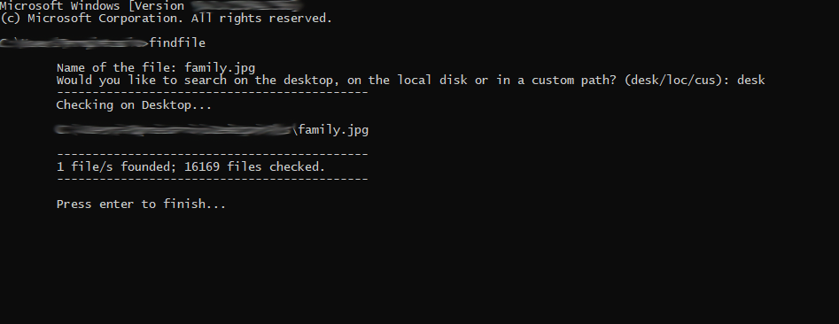

# File Finder
This script finds any lost file in the users computer. It can be implemented as a CMD command.

## How it works
This script maps the computer looking for a specified file. When the user inputs the name of the file, they are also asked to input the path where they want to search. There's three options:

```
- desk: Looks for the specifid file in the destkop. 
- loc: Looks for the file in the entire computer.
- cus: Looks for the file in a custom path specified by the user.
```

This script is ment to be a console command. In order to do so, copy the 
```
findfile.exe
```
into the System32 folder. After that, open the terminal and type 
```
> findfile
```

Then, the code should be executed.

The code returns the path to the file and the number of posts checked and founded.
## Example:




## Requisites:

None

## Installing

- Download or clone the repository.
- Copy findfile.exe to System32
- run the terminal
- Type:
```
> findfile
```
- Alternatively: Run the python script

## How to use:
- Execute the findfile command or execute the python file
- Specify the name and extension of the file (or just extension)
- Specify the mode (desk/loc/cus)
- Wait until the script stops running

### Works for sure on:

- Windows 10 with Python 3.9
